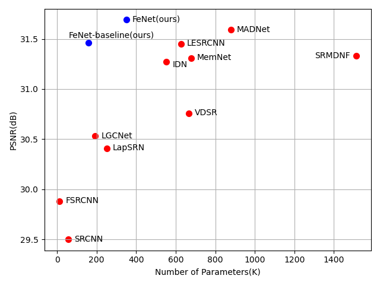
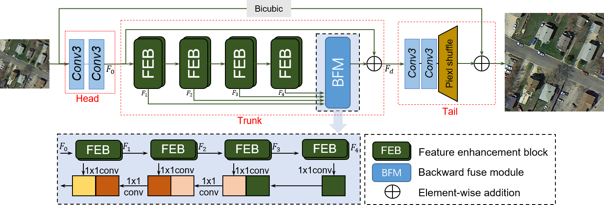
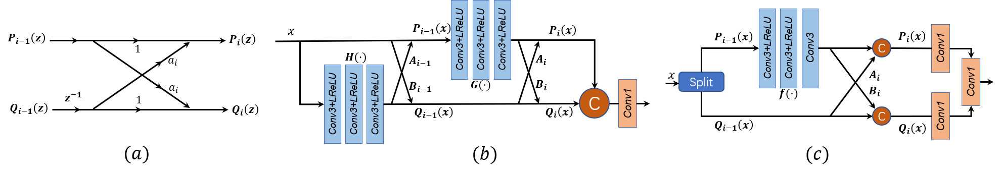
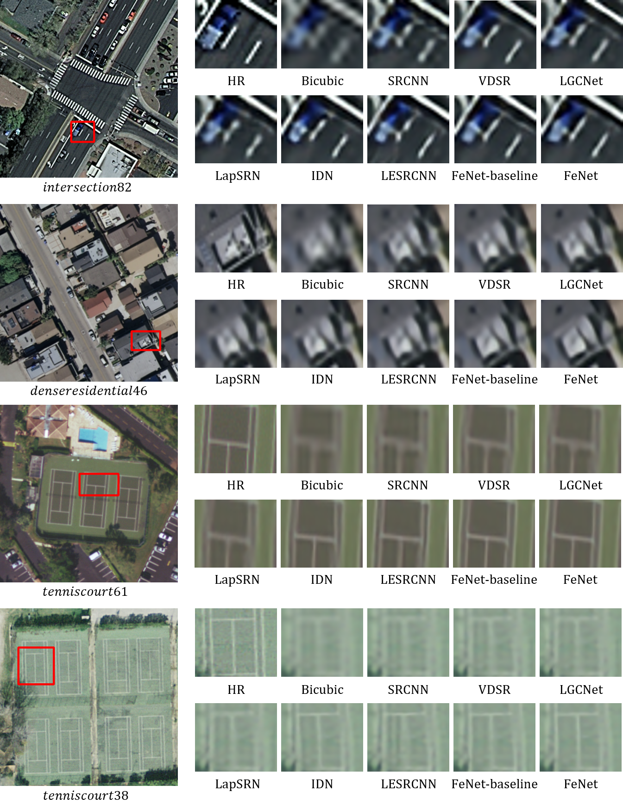
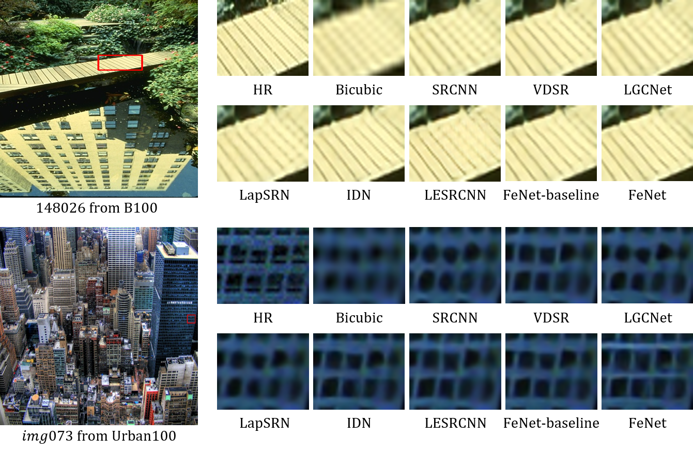

# FeNet: Feature Enhancement Network for Lightweight Remote-Sensing Image Super-Resolution 

This repository is for FeNet introduced in the following paper

Z. Wang et al., "FeNet: Feature Enhancement Network for Lightweight Remote-Sensing Image Super-Resolution," in IEEE Transactions on Geoscience and Remote Sensing,  2022,  [[paper](https://ieeexplore.ieee.org/document/9759417)]

  


# Abstract
In the field of remote sensing, due to memory
consumption and computational burden, the single image superresolution (SR) methods based on deep convolution neural networks (CNNs) are limited in practical application. To address this problem, we propose a lightweight feature enhancement network (FeNet) for accurate remote sensing image super-resolution (SR).
Considering the existence of equipment with extremely poor
hardware facilities, we further design a ligher FeNet-baseline with
about 158K parameters. Specifically, inspired by lattice structure,
we construct a lightweight lattice block (LLB) as nonlinear
feature extraction function to improve the expression ability.
Here, channel separation operation makes the upper and lower
branches of the LLB only responsible for half of the features,
and the weight coefficients calculated through the attention
mechanism enable the upper and lower branches to communicate
efficiently. Based on LLB, the feature enhancement block (FEB) is
designed in a nested manner to obtain expressive features, where
different layers are responsible for the features with different
texture richness, and then features from different layers are
sequentially fused from deep to shallow. Model parameters and
multi-adds operations are used to evaluate network complexity,
and extensive experiments on two remote sensing and four SR
benchmark test datasets show that our methods can achieve good
trade-off between complexity and performance. 


## Train
* Download [Training dataset DIV2K](https://drive.google.com/open?id=12hOYsMa8t1ErKj6PZA352icsx9mz1TwB)
* You can use [Prepare_TestData_HR_LR.m](Prepare_TestData_HR_LR.m) to generate low-resolution remote sensing images from the corresponding high-resolution remote sensing images.

* Convert png file to npy file
```bash
python scripts/png2npy.py --pathFrom /path/to/DIV2K/ --pathTo /path/to/DIV2K_decoded/
```
* Run training x2, x3, x4 model
```bash
python train.py --root /path/to/DIV2K_decoded/ --scale 2  
python train.py --root /path/to/DIV2K_decoded/ --scale 3 
python train.py --root /path/to/DIV2K_decoded/ --scale 4 
```


## Test

* Runing test:
```bash
# Set5 x2 
 python test.py --test_hr_folder ./Test_Datasets/set5/HR/ --test_lr_folder ./Test_Datasets/set5/LR_bicubic/x2/ --output_folder ./results/figure --checkpoint ./checkpoints/FeNet_x2.pth --upscale_factor 2
``` 
Note that the  PSNR and SSIM  can also be evaluated on Matlab R2017a and the code can be referred to [Evaluate_PSNR_SSIM.m](https://github.com/yulunzhang/RCAN/blob/master/RCAN_TestCode/Evaluate_PSNR_SSIM.m).  And [test.py](test.py) is the pytorch version of Evaluate_PSNR_SSIM.m.


# Remote sensing test datasets
RS-1 and RS-2 used in this paper. Download from [here](https://pan.baidu.com/s/1ZSJjsr98E-CIQhjsi3XSgw?pwd=ojfq )


# Model parameters

<p align="center">
     <br />
    <em> Model parameters and accuracy trade-off with the state-of-the-art
lightweight methods on Urban100 for 2× SR. Our proposed FeNet achieves
superior performance, and our FeNet-baseline also maintains competitive
performance.</em>
</p>

# Architecture of FeNet

<p align="center">
     <br />
    <em>The overall network architecture of the proposed FeNet. </em>
</p>

# Lightweight lattice block

<p align="center">
     <br />
    <em>The structure of feature enhancement block (FEB). </em>
</p>

# Visiual results
<p align="center">
     <br />
    <em> Visualization results  on UC-Merced for 3× SR</em>
</p>

<p align="center">
     <br />
    <em> Visualization results on B100 and Urban100 datasets for 3× SR.</em>
</p>

# Acknowledge
The code is built on IMDN and RCAN  (PyTorch).  See [IMDN](https://github.com/Zheng222/IMDN) and [RCAN](https://github.com/yulunzhang/RCAN) for details
# Citation

If you find FeNet useful in your research, please consider citing:

```
@ARTICLE{9759417,
  author={Wang, Zheyuan and Li, Liangliang and Xue, Yuan and Jiang, Chenchen and Wang, Jiawen and Sun, Kaipeng and Ma, Hongbing},
  journal={IEEE Transactions on Geoscience and Remote Sensing}, 
  title={FeNet: Feature Enhancement Network for Lightweight Remote-Sensing Image Super-Resolution}, 
  year={2022},
  volume={60},
  number={},
  pages={1-12},
  doi={10.1109/TGRS.2022.3168787}}

